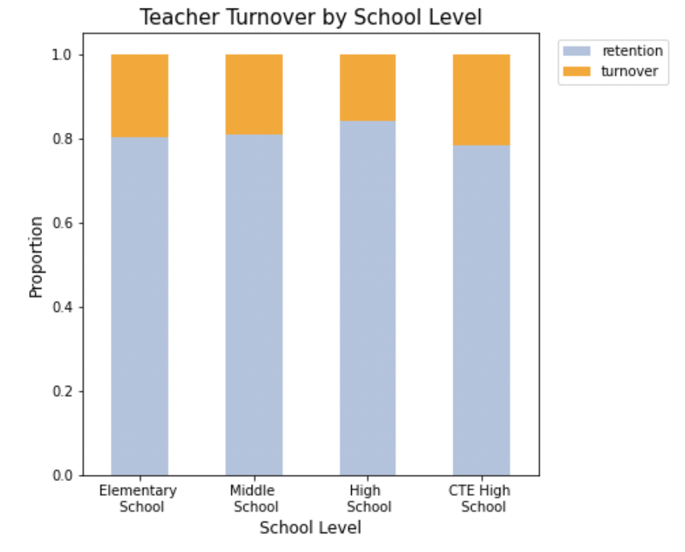
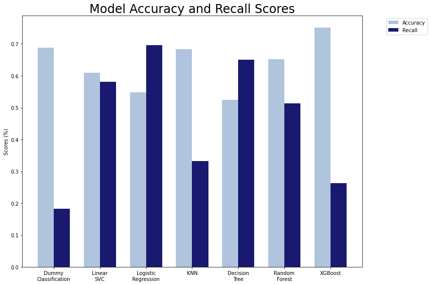
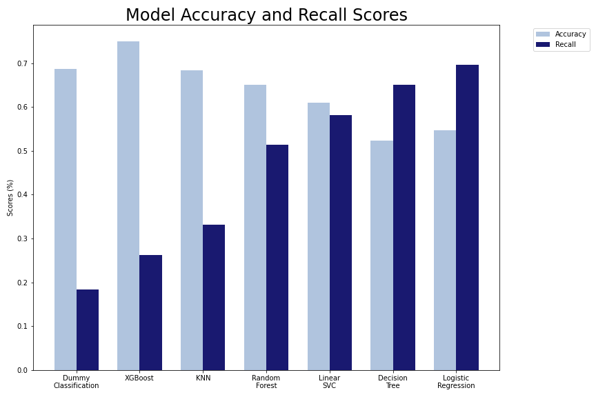

# Predicting Teacher Turnover
  

# Table of Contents
* [Overview](https://github.com/mross715/Predicting_Teacher_Turnover#overview)
* [Business Understanding](https://github.com/mross715/Predicting_Teacher_Turnover#business-understanding)
* [Data Understanding](https://github.com/mross715/Predicting_Teacher_Turnover#data-understanding)
* [Data Preparation](https://github.com/mross715/Predicting_Teacher_Turnover#data-preparation)
* [Modeling](https://github.com/mross715/Predicting_Teacher_Turnover#modeling)
* [Final Model](https://github.com/mross715/Predicting_Teacher_Turnover#final-model)
* [Conclusions and Future Work](https://github.com/mross715/Predicting_Teacher_Turnover#conclusions-and-future-work)

# Overview
project overview

# Business Understanding
Teacher turnover has been identified as one of the key factors contributing to teacher shortages, which have been growing since 2015. According to the [Learning Policy Institute](https://learningpolicyinstitute.org/product/teacher-turnover-brief), about 8% of teachers leave the profession each year, two-thirds of them for reasons other than retirement and another 8% shift to different schools each year. Additionally, beginning teachers have the highest turnover rates and somewhere between 40-50% of those that go into teaching are gone within five years.

High turnover rates have been found to lower student achievement and are costly for schools. The revolving door of teacher turnover costs school districts upwards of $2.2 billion a year nationally. In 2019, The [Philadelphia Inquirer](https://www.inquirer.com/news/philadephia-district-schools-teacher-turnover-solutions-20190503.html) found that there were 26 schools in the 217 School District of Philadelphia public schools that have lost at least 25 percent of their teachers for four years straight or lost more than one-third in each of the last two school years. Richard Ingersoll, a University of Pennsylvania professor and expert in school staffing, called these findings “appalling.”

The goal of this project is to create a classification model for the School District of Philadelphia that predicts which teachers will leave their current school of employment at the end of a school year. This model will allow district administrators to reduce the negative costs associated with teacher turnover by providing intervention in attempts to retain those teachers who are identified as leaving, or by notifying school administrators to prepare earlier to hire quality teachers to fill vacancies.

The metric of interest for this project is recall. By looking to maximize the recall, the aim is to minimize false negatives where the model predicts that a teacher will stay in their current school when they actually end up leaving. Missing predictions of actual teacher turnover would be costly to the district because they would have to hire and train new teachers unexpectedly. In this circumstance, false positives could also result in monetary cost to provide what could be considered unnecessary intervention, as false positives occur when the model predicts a teacher will leave their school, but they actually stay the following school year. Compared to the costs of false negatives, the costs of false positives could actually end up having a positive effect on long term retention and are not nearly as costly of having to hire and train new teachers.

# Data Understanding
For this project, publicly available data was gathered from the School District of Philadelphia. 

[Research](https://cepa.stanford.edu/content/how-teaching-conditions-predict-teacher-turnover-california-schools) on teacher turnover has shown that occupational factors and student demographic factors influence turnover, so both types of features were incorporated to the final data frame.

The datasets were:

* [Employee Information](https://www.philasd.org/performance/programsservices/open-data/district-information/#employee_data): This data included the occupational factors for individual teachers including gender, salary, and their title description.
* [School Progress Reports](https://www.philasd.org/performance/programsservices/school-progress-reports/spr-helpful-resources/): This data includes school ratings in the areas of achievement, progress, and climate.
* [Student Enrollment & Demographic Information](https://www.philasd.org/performance/programsservices/open-data/school-information/#school_enrollment): This data includes student demographic factors which includes the rates of economically disadvantaged, ELL (English Language Learners), IEP (Special Education), and ethincity by school.

The final dataset that resulted from merging the occupational factors with student demographic factors contained approximately 8,000 records representing teachers in the School District of Philadelphia from the 2017-2018 school year. Those teachers were identified as either returning to their current placement or having turned over using employee information from the 2018-2019 school year. 

# Data Preparation

# Modeling

modeling

# Final Model

On the holdout test set, the Logisitic Regression model performs at 63% for the recall score. The model does a good job of reducing those false negative where retention was predicted, but the teacher actually left their school. It's clear that the model is struggling to make correct predictions for teachers that were retained in their school with a lot of false positives, however, false positives in this context are not as negatively impactful to schools and the costs associated with high teacher turnover rates.

# Conclusions and Future Work
The recall score (63%) of the best model, Logistic Regression with PCA, is lower than ideal. However, being able to predict teacher turnover and plan ahead for intervention to retain teachers within the school district is better than high rates of teacher turnover that are costly with no information as to why.

To improve the predictive power of the model, I recommend the following for next steps:

* Obtain additional occupational factors including certification pathway, subject taught, and evaluation scores.
* Expand model for use in other large urban school districts.

